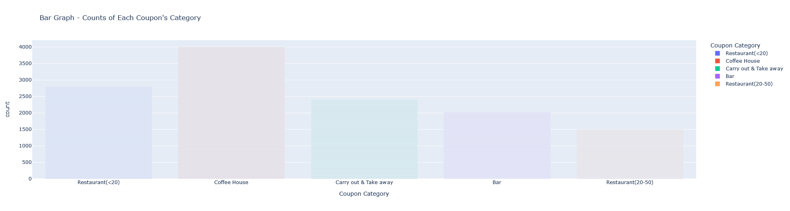
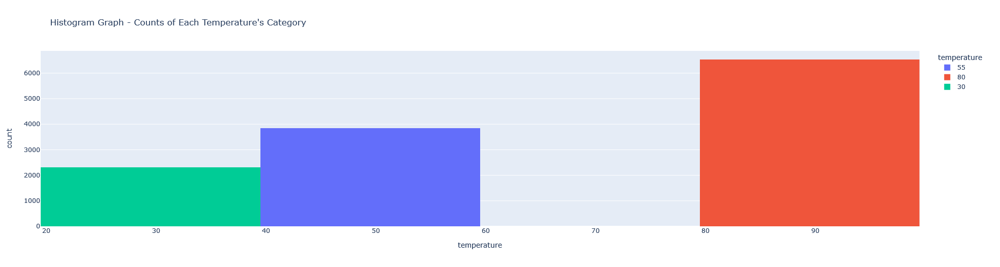
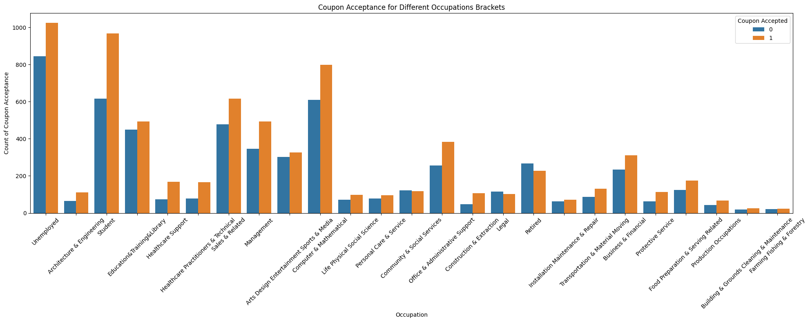
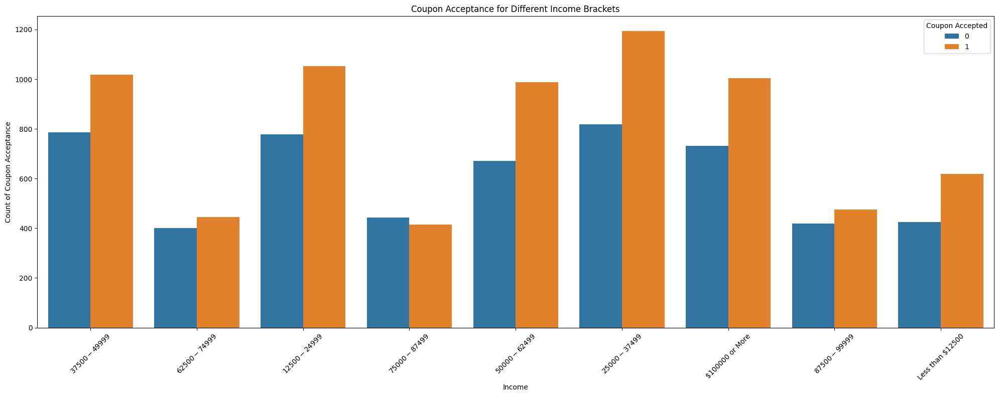
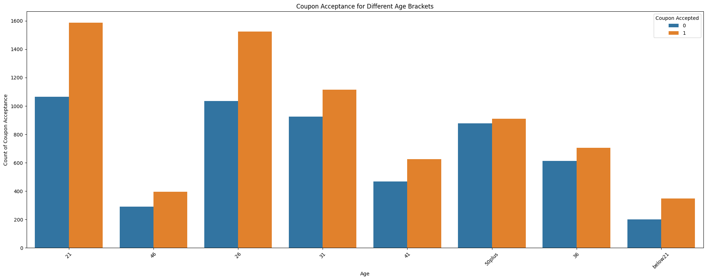
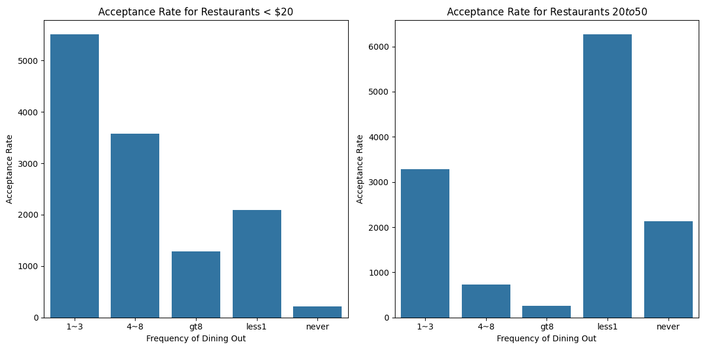
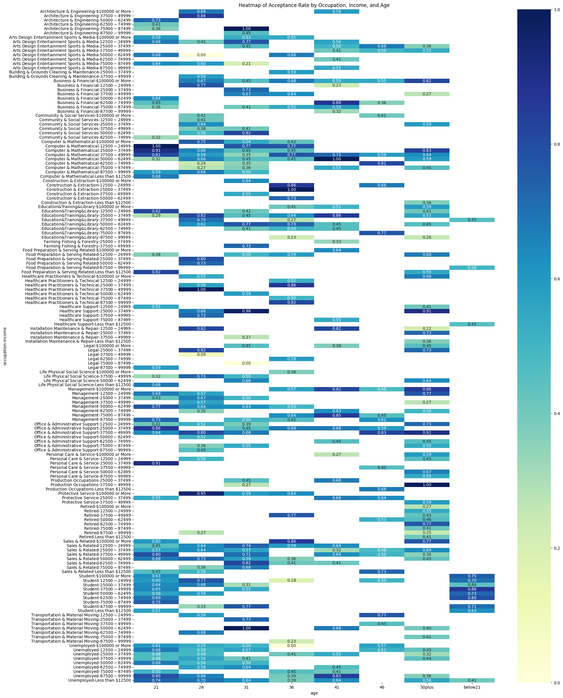

# UC Berkeley ML/AI - Practical_assignment_1
## Will-a-Customer-Accept-the-Coupon?

The main goal of this project is to observe through data analysis and visualization of probability distribution to investigate the variable on what make the differnces between driver who accept coupons and who does not.

### Jupyter Notebook:
- In this project, the full analysis include observation, commnents, insight analysis will be in this notebook:
    ( [Jupiter Notebook used]https://github.com/dcnguyen060899/Will-a-Customer-Accept-the-Coupon/blob/main/notebook/prompt_assig5_1.ipynb)

### Report:

#### 1. Observe Dataset - Finding  Out Missing Values
- I used ```data.info()``` and notice that some numerical variable like Age is an obj/str instead of int. At first I thought this would pose a problem in the later analysis but we can use ```.isin()``` for conditional data analysis for conditional probability distribution later.
- Then I used ```data.isnull().sum()``` and found out that:
car                     12576
Bar                       107
CoffeeHouse               217
CarryAway                 151
RestaurantLessThan20      130
Restaurant20To50          189

- I then want to observe the proportion of missing value across the whole dataset in percentage. I used ```{column: value / len(data) for column, value in missing_value.items()}```:

{'destination': 0.0,
 'passanger': 0.0,
 'weather': 0.0,
 'temperature': 0.0,
 'time': 0.0,
 'coupon': 0.0,
 'expiration': 0.0,
 'gender': 0.0,
 'age': 0.0,
 'maritalStatus': 0.0,
 'has_children': 0.0,
 'education': 0.0,
 'occupation': 0.0,
 'income': 0.0,
 'car': 0.9914853358561968,
 'Bar': 0.008435824660990224,
 'CoffeeHouse': 0.017108167770419427,
 'CarryAway': 0.011904761904761904,
 'RestaurantLessThan20': 0.010249132765689057,
 'Restaurant20To50': 0.014900662251655629,
 'toCoupon_GEQ5min': 0.0,
 'toCoupon_GEQ15min': 0.0,
 'toCoupon_GEQ25min': 0.0,
 'direction_same': 0.0,
 'direction_opp': 0.0,
 'Y': 0.0}

- In this dictionary, there are 99.14 % of car values are missing. This is an indication that the data collection process has flawed. Therefore, I will dropped the column. Others value only account for less than 2% of missing value. Since the proportion of missing data is not exceedingly high. I will impute the missing data with the most frequent category, its mode.

#### 2. Drop and Replace Missing Value:
- I decided to drop the car column because there was obviously an error during data collection that almost to all of the car data has gone missing.
  
```python 
data = data.drop('car', axis=1)
```

- Then for columns like Bar, CoffeeHouse, CarryAway, RestaurantLessThan20, and Restaurant20To50, I decided to impute them base on their mode because it is a categorical variable. For each column, I want to fill in the missing value with the variable that appear the most.
  - Update the missing columns and map the name out in the list:
  ```python
    missing_value = data.isnull().sum()
    missing_col = [column for column, value in missing_value.items() if value > 0]
  ```
  - Then I looped through each column individually and find common value of each column then impute each column individually:
    for column in missing_col:
      ```python
      mode_value = data[column].mode()[0]
      data[column].fillna(mode_value, inplace=True)
      ```
- Now I check the missing value again:
destination             0
passanger               0
weather                 0
temperature             0
time                    0
coupon                  0
expiration              0
gender                  0
age                     0
maritalStatus           0
has_children            0
education               0
occupation              0
income                  0
Bar                     0
CoffeeHouse             0
CarryAway               0
RestaurantLessThan20    0
Restaurant20To50        0
toCoupon_GEQ5min        0
toCoupon_GEQ15min       0
toCoupon_GEQ25min       0
direction_same          0
direction_opp           0
Y                       0
dtype: int64

There appear to be no more missing value.

#### 3. Proportion of Acceptance Rate:
- Notice, the acceptance rate ('Y') is a binary. When taking the mean of the column, we will get back the proportion of 1 over the dataset. So:

```python
proportion_acceptance_rate = data.Y.mean()
```

- The proportion of observations that accepted the coupon is: 0.5684326710816777

- Furthermore, by finding the value counts using .value_counts() function:
```python
value_count_Y = data.Y.value_counts()
```

You may then also observe the number of those who did not accept the coupon relative to the those who did.

#### 4. Visualize the Coupon Column:
```python
bar_plot_coupon = px.bar(data, x='coupon', color='coupon', title="Bar Graph - Counts of Each Coupon's Category", labels={'coupon': 'Coupon Category'})
bar_plot_coupon.show()
```

We get:



- As restaurant gets more expensive, there are fewer and fewer coupon giveaway. There has to be a reason behind it. My hypothesis is due to income of different drivers.

#### 5. Visualize the Temperature Column:
```python
hist_plot_temp = px.histogram(data, x='temperature', color='temperature', title="Histogram Graph - Counts of Each Temperature's Category", nbins=3)
hist_plot_temp.show()
```

- Remember, the temperature is in Farenheit. We get:



- As temperature reaching a summer-like ( around 80F - 90F ), there are more counts for this categories. Maybe it is an indication of more driver are going out more due to nice weather in the summar, and have higher chance of accepting coupons.

#### 6. Understanding the Bar Coupon:
- I used
```python
round(data[data['coupon'] == 'Bar'][['coupon', 'Y']].mean(numeric_only=True)[0], 2) * 100
```
to observe the proportion of bar coupons were accepted

- We observed that the proportion of bar coupons were accepted is 41.0%

- Now we want to compare the acceptance rate between those who went to a bar 3 or fewer times a month to those who went more. I used
 ```python
 round(data[data['Bar'] == '1~3']['Y'].mean(numeric_only=True), 3) * 100
 ```

We get:
- The acceptance rate between those who went to a bar 3 or fewer times a month: 62.2% to those who went more: 62.2%. There is not quite a difference between people who either go to bar 3 or fewer times or more than that.

- Now let's observe the acceptance rate between drivers who go to a bar more than once a month and are over the age of 25 to the all others.
- I used:
  ```python
  round(data[data['Bar'].isin(['1~3', '4~8', 'gt8']) & (data['age'].isin(['46', '26', '31', '41', '50plus']))]['Y'].mean(numeric_only=True), 3) * 100
  ```
  ```python
  round(data[data['Bar'].isin(['never', 'less1']) & (data['age'].isin(['46', '26', '31', '41', '50plus']))]['Y'].mean(numeric_only=True), 3) * 100
  ```

We get:
- The difference between acceptance rate between drivers who go to bar more than once a month and are over 25: 61.5% compare to driver who are 25 and go than less than a month: 53.5%
In this case, adding the factor of age into the picture, there is a different between driver. This implying that there is a correlation that age is a factor that impact whether the driver are more likely to accept or not.

Now we add another layer of dimension to see if occupation influence the acceptance rate. I used:
```python
    more_than_once = data[
    data['Bar'].isin(['1~3', '4~8', 'gt8']) &
    data['passanger'].isin(['Alone', 'Friend(s)', 'Partner']) &  
    ~data['occupation'].isin(['Farming', 'Fishing', 'Forestry'])]['Y'].mean(numeric_only=True)
```

```python
    less_than_once = data[
    data['Bar'].isin(['less1', 'never']) &
    data['passanger'].isin(['Alone', 'Friend(s)', 'Partner']) &  
    ~data['occupation'].isin(['Farming', 'Fishing', 'Forestry'])]['Y'].mean(numeric_only=True)
```

- Given the output of this code, we continue to see a pattern that the acceptance rate between drivers who go to bars more than once a month and had passengers that were not a kid and had occupations other than farming, fishing, or forestry: 62.3% compare to those who goes less than 1 or never: 55.1%.
- The pattern continue to suggest that occupation also a interdepent factor that affect whether drivers probability of accepting the coupon or not.
Our question as now is what if we add even more variable into the equation, what would the behaviour of the driver regarding acceptance explaination:
- When we used this code, we observed:
```python
    driver_group1 = data[
    (data['Bar'].isin(['1~3', '4~8', 'gt8']) & ~data['passanger'].isin(['Kids']) & ~data['maritalStatus'].isin([['Widowed']]))]['Y'].mean()
```
```python
    driver_group2 = data[
    (~data['Bar'].isin(['never', 'less1']) & ~data['age'].isin(['50plus', '46', '41', '36']))]['Y'].mean()
```
```python
    driver_group3 = data[    
    (data['RestaurantLessThan20'].isin(['4~8', 'gt8']) & data['income'].isin(['$37500 - $49999']))]['Y'].mean()
```

- The acceptance rate of drivers who go to bars more than once a month, had passengers that were not a kid, and were not widowed: 62.2% OR 
 The acceptance rate of drivers who go to bars more than once a month and are under the age of 30: 61.8% OR 
 The acceptance rate of drivers who go to cheap restaurants more than 4 times a month and income is less than 50K: 62.9%

- From this probability distribution data analysis, this tells us a story that driver who income are low + not widow + no kid +  young tend to spend more time at the bar, go to cheap restuarant and are more likely to accept coupon. So then this explain that age + income + occuaption are the three main factor from observation that contributed to the difference between driver who accept coupon and those who's not.

- Before we go to the visualization for better understanding of what makes driver who accept coupon and those who's not different from each other, I want to make some hypothesis and we will come back to see if out hypothesis was correct:
 1. My hypothesis is that coupon acceptance rate affected more by drivers' lifestyle than demographic factors.
 2. Younger drivers and those who has lower inconme show a slightly higher acceptance rate, most likely due to the social outing interest.
 3. Furthermore, the fact that drivers without kids and with specific occupations illustrate a higher rate of accpeting coupon.
 4. In short, acceptance rate isn't a matter of chacne but more nuanced derivative from drivers' combination of social habits, economic status, and life circumstances. Meaning those who are already enjoy bar life then are more inclined toward accepting coupon.

#### 7. Visualization:

##### Observe affecting Acceptance Rate Individually
Let's observed whether **occupation** affecting the rate of acceptance through bar graph:
We used this code:

```python
plt.figure(figsize=(20, 8))

sns.countplot(x='occupation', hue='Y', data=data)

plt.title('Coupon Acceptance for Different Occupations Brackets')
plt.xlabel('Occupation')
plt.ylabel('Count of Coupon Acceptance')

# rotate the x-axis for readability
plt.xticks(rotation=45)
plt.legend(title='Coupon Accepted', loc='upper right')  
plt.tight_layout() 
plt.show()
```

We get:


- This is an interesting graph. By observation, we see that unemployment accept the most coupon. This intuitively makes sense because they don't earn a lot of money to taking any discount would save themm financially. Another cool observation would be between student and Architecture and Engineering, there is a wide imbalance between the two group acceptance rate. This intuitively makes sense also because student tends to make no mmoney and they would appreciate coupon to save some money.

- Overall, what I observe is that most blue collar job accept less coupon. My guess is because they are less involve in the digital world where I believe to be the most marketing. White collar jobs tend to involve more around the media and tech in general, therefore, they are mmore expose to digital advertisement.

What about **income**, how does it affect the accpetance rate?
```python
plt.figure(figsize=(20, 8))

sns.countplot(x='income', hue='Y', data=data)

plt.title('Coupon Acceptance for Different Income Brackets')
plt.xlabel('Income')
plt.ylabel('Count of Coupon Acceptance')

# rotate the x-axis for readability
plt.xticks(rotation=45)
plt.legend(title='Coupon Accepted', loc='upper right')  #
plt.tight_layout() 
plt.show()
```



- In this graph, we observe that people who are making less money tend to has high rate of acceptance. Again, this prove our hypothesis that being low income will take high chance to accept coupon for discount and save some money.

- Though, if you notice, people who make a lot of money (more than 100k), tend to have a 'YOLO' acceptance rate because they want to save even more money. They probably just laying around and not worry about money therefore have time to accept coupon at the bar.

Now what about **age**, what is the behavior of age affecting on coupon acceptance rate?
```python
plt.figure(figsize=(20, 8))

sns.countplot(x='age', hue='Y', data=data)

plt.title('Coupon Acceptance for Different Age Brackets')
plt.xlabel('Age')
plt.ylabel('Count of Coupon Acceptance')

# rotate the x-axis for readability
plt.xticks(rotation=45)
plt.legend(title='Coupon Accepted', loc='upper right')
plt.tight_layout() 
plt.show()
```



- This graph solify our hypothesis earlier given that young individuals tend to accept more coupon due to being either poor or super rich, regardless young people either extreme measure with higer rate of acceptance.

- One other point is that it is very low rate with age below 21 because of legal factor.

At this point, let's combine all three factor and take the average and count of acceptance rate impacting by all three other features through group by:
```python
# find the average and the frequency of acceptance rate given groupy of occupation and income
acceptance_rateCounts_by_group = data.groupby(['occupation', 'income', 'age'])['Y'].agg(['mean', 'count']).reset_index()

# rename the columns
acceptance_rateCounts_by_group.rename(columns={'mean': 'Acceptance_Rate', 'count': 'Total_Count'}, inplace=True)

# sort the value in descending values
sorted_group = acceptance_rateCounts_by_group.sort_values(by='Acceptance_Rate', ascending=False)

fig = px.bar(
    sorted_group,
    x='age',
    y='Acceptance_Rate',
    color='income',
    title='Coupon Acceptance Rate by Occupation and Annual Income',
    labels={'Acceptance_Rate': 'Acceptance Rate', 'age': 'Age', 'annual_income': 'Annual Income'}
)

fig.update_layout(
    xaxis_title='Age',
    yaxis_title='Acceptance Rate',
    legend_title='Annual Income',
    xaxis_tickangle=-45,  # Rotate the x-axis labels
    barmode='group',
    legend=dict(
        yanchor="top",
        y=0.99,
        xanchor="right",
        x=1.01
    ),
    autosize=False,
    width=2500,
    height=1000
)

fig.show()
```


- This graph is a combination group by, finding the average acceptance rate and count of each group (occupation, income, and age). What I noticed is that low income really enjoy bar life and having higher count of accepting coupon. Though, individual makes less thatn 12,500 are most likely those who are underage therefore have lower rate of acceptance due to no prevalance at the bar life.
- Also young people on average seems to have a higher distribution of count on acceprtance rate suggest that the lifestyle of being young and low income really a factor that differential on the difference between driver who accepts and those who's not.

- Second to last, given that people who are low income goes to bar often as lifestyle, I want to observe how often their dinning out affect the acceptance rate as well. I want to observe this because I would intuitively believe that people who dinning out less tend to be low income because they are trying to save money. I would expect or hypothesize that low dinning out frequency would have higher acceptance rate count.

```python
data['Accepted'] = data['Y'] == '1'
acceptance_rate_less_than_20 = data.groupby('RestaurantLessThan20')['Accepted'].count().reset_index()

plt.figure(figsize=(12, 6))

plt.subplot(1, 2, 1)
sns.barplot(x='RestaurantLessThan20', y='Accepted', data=acceptance_rate_less_than_20)
plt.title('Acceptance Rate for Restaurants < $20')
plt.xlabel('Frequency of Dining Out')
plt.ylabel('Acceptance Rate')

acceptance_rate_20_to_50 = data.groupby('Restaurant20To50')['Accepted'].count().reset_index()

plt.subplot(1, 2, 2)
sns.barplot(x='Restaurant20To50', y='Accepted', data=acceptance_rate_20_to_50)
plt.title('Acceptance Rate for Restaurants $20 to $50')
plt.xlabel('Frequency of Dining Out')
plt.ylabel('Acceptance Rate')

plt.tight_layout()
plt.show()
```



- For both restuarants, we observe that either cheap or more expensive restuarants, driver will go out less (13, 48, and less1), this indicates that drivers are lower income. This solidify the hypothesis that lower income individuals tend to accept coupon for discount and save more money. This really solidify my hypothesis I just made earlier.

- Last but not least, let's observe all variables correlation to the acceptance rate on a heatmap. To be warn, the heatmap would seem a bit messy but with attention to detail, we would depict some useful insight from the heatmap. Let's go through it.

```python 
# Group by 'occupation', 'income', and 'age', then calculate the mean and count of 'Y'
acceptance_rateCounts_by_group = data.groupby(['occupation', 'income', 'age'])['Y'].agg(['mean', 'size']).reset_index()

# Rename the columns
acceptance_rateCounts_by_group.rename(columns={'mean': 'Acceptance_Rate', 'size': 'Total_Count'}, inplace=True)

# Sort the values in descending order by 'Acceptance_Rate'
sorted_group = acceptance_rateCounts_by_group.sort_values(by='Acceptance_Rate', ascending=False)

# pivot the table for the heatmap
pivot_table = sorted_group.pivot_table(index=['occupation', 'income'], columns='age', values='Acceptance_Rate')

# Plotting the heatmap
plt.figure(figsize=(20, 30))
heatmap = sns.heatmap(pivot_table, annot=True, fmt=".2f", cmap="YlGnBu")
plt.title('Heatmap of Acceptance Rate by Occupation, Income, and Age')
plt.show()
```



- This heatmap tells us a lot of about the difference in occupation, income and age between those who accept coupons and those do not.
- For income, I noticed that some high income possessed both high and low acceptance rates. Income alone then would not determine whether drivers would accept coupons or not, that occupation and age would take into consideration.
- Through observation, I can tell you that occupation like Management, Computer & Mathematical, and Health Practitioners with a certain income level have a higher chance of accepting due to lifestyle.
- In comparison to jobs like Production, Food Preparation & Serving, or Building & Grounds Cleaning & Maintenance show a higher variance in accepting coupon.
- These two example well explained the nature of occupation's environment and lifestyle where it would lead on inclined toward accepting coupons.
- However, to say a definitive conclusion through visualization on the interplay between occupations, income, and age on acceptance rate is complex. Again, the impact of these variables on acceptance rate rather be an interdependent relationship. For example, young people in tech would have higher chance accepting digital coupons.
- Through this heatmap, with attention to detail, you may make more interesting observation that might abstractly lies in the heatmap.

## Conclusion:


1. The data analysis and visualization of probability distribution a clear difference between driver who accepts and those do not accept coupons.Certain factors in combination like, job type, age range, and yearly income, working interdepently appear to influence how people decide to rate of people accepting coupon. We observed that customers from particular professional backgrounds and financial standings tend to accept coupons at a higher rate. Most importantly, acceptance rates varies accross age groups, suggesting me that it is a crucial factor in drivers' decision to accept coupon.
2. Given these observation, this would craft an effective marketing strategies that appear in the data. For example, younger customer between 21 and 26, as well as those earn either really low, below 12,500 and those who earns extremely high, above 100,000 annually, are more receptive to coupon offers. I am not sure if this is a result of effect marketing or just the nature of variables but this for sure implying an establishment and implementation of a market stratigies to capitalize the profit from those two groups as an example.
3. In short, I believe with these understanding of the probability distributions that underpin these trends could be crucial in creating predictive models for future coupon distribution strategies, leading to more strategic marketing investments and better outcomes.
