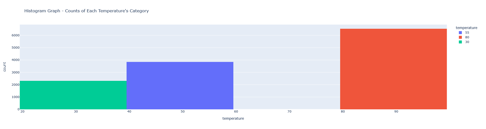

# UC Berkeley ML/AI - Practical_assignment_1
## Will-a-Customer-Accept-the-Coupon?

The main goal of this project is to observe through data analysis and visualization of probability distribution to investigate the variable on what make the differnces between driver who accept coupons and who does not.

### Jupyter Notebook:
- In this project, the full analysis include observation, commnents, insight analysis will be in this notebook:
    ( [Jupiter Notebook used]https://github.com/dcnguyen060899/Will-a-Customer-Accept-the-Coupon/blob/main/notebook/prompt_assig5_1.ipynb)

### Report:

#### 1. Observe Dataset - Finding  Out Missing Values
- I used data.info() and notice that some numerical variable like Age is an obj/str instead of int. At first I thought this would pose a problem in the later analysis but we can use .isin() for conditional data analysis for conditional probability distribution later.
- Then I used data.isnull().sum() and found out that:
car                     12576
Bar                       107
CoffeeHouse               217
CarryAway                 151
RestaurantLessThan20      130
Restaurant20To50          189

- I then want to observe the proportion of missing value across the whole dataset in percentage. I used {column: value / len(data) for column, value in missing_value.items()}:

{'destination': 0.0,
 'passanger': 0.0,
 'weather': 0.0,
 'temperature': 0.0,
 'time': 0.0,
 'coupon': 0.0,
 'expiration': 0.0,
 'gender': 0.0,
 'age': 0.0,
 'maritalStatus': 0.0,
 'has_children': 0.0,
 'education': 0.0,
 'occupation': 0.0,
 'income': 0.0,
 'car': 0.9914853358561968,
 'Bar': 0.008435824660990224,
 'CoffeeHouse': 0.017108167770419427,
 'CarryAway': 0.011904761904761904,
 'RestaurantLessThan20': 0.010249132765689057,
 'Restaurant20To50': 0.014900662251655629,
 'toCoupon_GEQ5min': 0.0,
 'toCoupon_GEQ15min': 0.0,
 'toCoupon_GEQ25min': 0.0,
 'direction_same': 0.0,
 'direction_opp': 0.0,
 'Y': 0.0}

- In this dictionary, there are 99.14 % of car values are missing. This is an indication that the data collection process has flawed. Therefore, I will dropped the column. Others value only account for less than 2% of missing value. Since the proportion of missing data is not exceedingly high. I will impute the missing data with the most frequent category, its mode.

#### 2. Drop and Replace Missing Value:
- I decided to drop the car column because there was obviously an error during data collection that almost to all of the car data has gone missing.
  - data = data.drop('car', axis=1)

- Then for columns like Bar, CoffeeHouse, CarryAway, RestaurantLessThan20, and Restaurant20To50, I decided to impute them base on their mode because it is a categorical variable. For each column, I want to fill in the missing value with the variable that appear the most.
  - Update the missing columns and map the name out in the list:
    missing_value = data.isnull().sum()
    missing_col = [column for column, value in missing_value.items() if value > 0]
  - Then I looped through each column individually and find common value of each column then impute each column individually:
    for column in missing_col:
      mode_value = data[column].mode()[0]
      data[column].fillna(mode_value, inplace=True)
      
- Now I check the missing value again:
destination             0
passanger               0
weather                 0
temperature             0
time                    0
coupon                  0
expiration              0
gender                  0
age                     0
maritalStatus           0
has_children            0
education               0
occupation              0
income                  0
Bar                     0
CoffeeHouse             0
CarryAway               0
RestaurantLessThan20    0
Restaurant20To50        0
toCoupon_GEQ5min        0
toCoupon_GEQ15min       0
toCoupon_GEQ25min       0
direction_same          0
direction_opp           0
Y                       0
dtype: int64

There appear to be no more missing value.

#### 3. Proportion of Acceptance Rate:
- Notice, the acceptance rate ('Y') is a binary. When taking the mean of the column, we will get back the proportion of 1 over the dataset. So:

proportion_acceptance_rate = data.Y.mean()

The proportion of observations that accepted the coupon is: 0.5684326710816777

Furthermore, by finding the value counts using .value_counts() function:

value_count_Y = data.Y.value_counts()

You may then also observe the number of those who did not accept the coupon relative to the those who did.

#### 4. Visualize the Coupon Column:

bar_plot_coupon = px.bar(data, x='coupon', color='coupon', title="Bar Graph - Counts of Each Coupon's Category", labels={'coupon': 'Coupon Category'})
bar_plot_coupon.show()

We get:
    

As restaurant gets more expensive, there are fewer and fewer coupon giveaway. There has to be a reason behind it. My hypothesis is due to income of different drivers.

#### 5. Visualize the Temperature Column:
hist_plot_temp = px.histogram(data, x='temperature', color='temperature', title="Histogram Graph - Counts of Each Temperature's Category", nbins=3)
hist_plot_temp.show()

Remember, the temperature is in Farenheit. We get:

    

As temperature reaching a summer-like ( around 80F - 90F), there are more counts for this categories. Maybe it is an indication of more driver are going out more due to nice weather in the summar, and have higher chance of accepting coupons.

